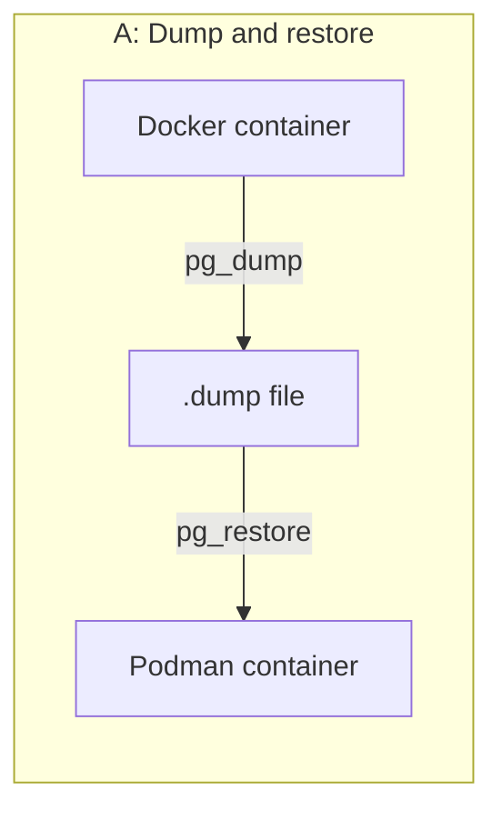
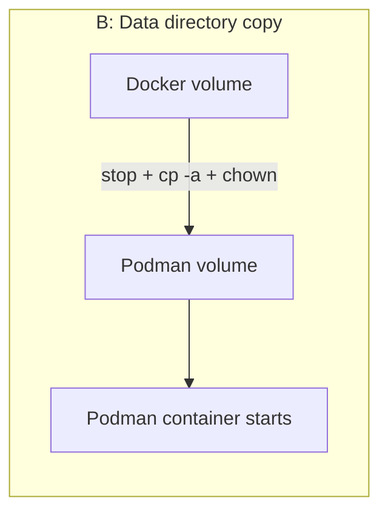
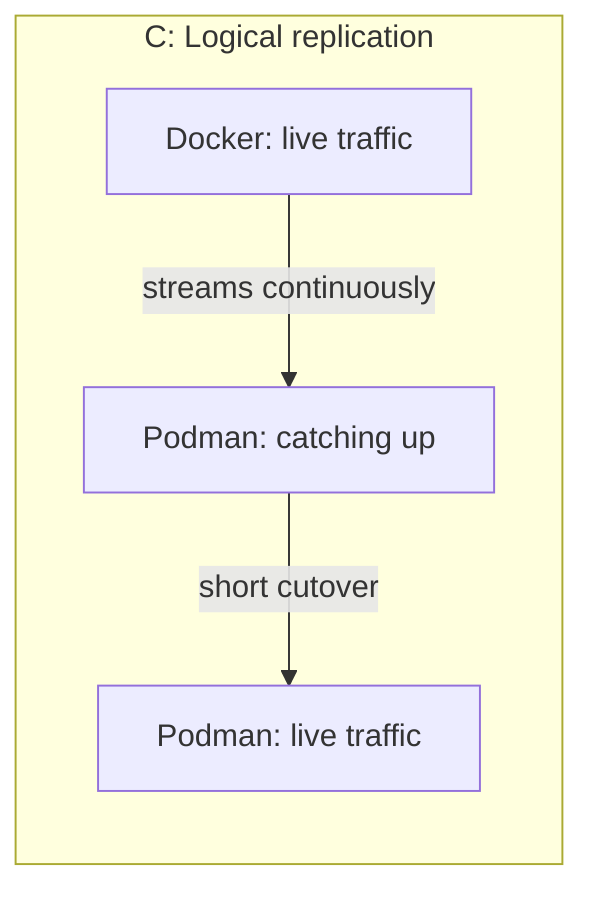

# Docker to Podman Migration — Approach A: Dump & Restore

> Part of a 3-approach PoC. See [README.md](./README.md) for the overview, analogy, and results across all approaches. Also see [Approach B](./APPROACH-B-DATA-DIR-COPY.md) and [Approach C](./APPROACH-C-LOGICAL-REPLICATION.md).

> Copy-paste every block in order, top to bottom, on any machine, as any user. No names, no paths need editing.

---

## Fixes applied in this version

If you hit any of these earlier, they're now handled automatically by the scripts below — you don't need to remember them, just run the steps in order.

| # | Problem | Cause | Fix applied |
|---|---|---|---|
| 1 | PostgreSQL container exits immediately on start | PostgreSQL 18+ images require the volume mounted at `/var/lib/postgresql`, not `/var/lib/postgresql/data` | All scripts use the correct mount path |
| 2 | `podman` container "disappears" between commands | Rootless (`podman`) and rootful (`sudo podman`) store containers in completely separate, invisible-to-each-other locations | Every migration script checks it's run with `sudo` and refuses to continue otherwise |
| 3 | Script fails with a path under `/root/...` even though you're not root | `sudo ./script.sh` resets `$HOME` to root's home, so any `~` inside the script silently points to the wrong place | Scripts compute their own location from the script file's path — no `~`, no `$HOME`, no hardcoded username, works for any user |
| 4 | `Error: open /etc/containers/policy.json: no such file or directory` | Some minimal Podman installs don't ship the default trust policy file | `install-podman.sh` creates a default policy file if it's missing |
| 5 | `docker: command not found`, even though `dpkg` shows `docker-ce`/`docker-ce-cli` already installed and `apt install` reports "already the newest version" | Package database (`dpkg`) was out of sync with the actual filesystem — `/usr/bin/docker` was missing on disk despite `dpkg -L docker-ce-cli` listing it | `sudo apt install --reinstall -y docker-ce docker-ce-cli containerd.io` re-lays the actual binary without needing a full purge |
| 6 | `Error: statfs .../podman-data: no such file or directory` when starting the Podman container | Docker auto-creates a host bind-mount directory if it's missing. Podman does not — it requires the directory to already exist. | Script now runs `mkdir -p` on the target data directory before `podman run` |

---

## 0. Before You Begin: Clean Environment Check

Run this first, every time — including the very first time.

```bash
echo "--- docker ---"
docker ps -a 2>/dev/null || echo "docker not installed yet"
echo "--- podman (rootless) ---"
podman ps -a 2>/dev/null || echo "podman not installed yet"
echo "--- podman (rootful) ---"
sudo podman ps -a 2>/dev/null || echo "podman not installed yet"
```

If anything old shows up, wipe it before continuing:

```bash
docker rm -f $(docker ps -aq) 2>/dev/null
docker system prune -a --volumes -f

podman rm -af 2>/dev/null
podman system prune -a --volumes -f 2>/dev/null
rm -rf ~/.local/share/containers ~/.config/containers

sudo podman rm -af 2>/dev/null
sudo podman system prune -a --volumes -f 2>/dev/null
sudo rm -rf /var/lib/containers
```

Only continue once all three lists are empty or say "not installed yet".

---

## 1. The Four Things You're Working With

| Term | What it means |
|---|---|
| **Image** | A read-only blueprint (e.g. `postgres:19beta2`). Never changes. Pulled fresh under both engines — it doesn't need "migrating". |
| **Container** | A running copy of an image. This is your live PostgreSQL process. |
| **Volume** | The actual database files, kept separate from the container so data survives restarts. **This is what you're actually migrating.** |
| **Network** | How you reach the container — e.g. `localhost:5432`. |

In one sentence: **migration means getting the same data (volume) running as a container under Podman instead of Docker — the image is just re-pulled, not moved.**

---

## 2. The Three Approaches — Pick One to Start

Try them **in this order**. Get Approach A fully working before attempting B or C.

| # | Approach | What actually happens | Downtime |
|---|---|---|---|
| **A** | Dump & restore | Export data as a `.dump` file with `pg_dump`, load it into a new Podman container with `pg_restore`. | Minutes |
| **B** | Data directory copy | Stop Docker, physically `cp` the volume folder, fix file ownership, point a new Podman container at the copied folder. | Seconds–minutes |
| **C** | Logical replication | Keep Docker running with live traffic, stream changes to Podman continuously, then flip over in one short pause. | Seconds |







**This guide covers Approach A only**, start to finish. B and C follow the same pattern once A works for you.

---

## 3. Install Docker and Podman

```bash
mkdir -p ~/poc-pg19-docker-to-podman/{scripts,docker-data,dumps,logs,results}
cd ~/poc-pg19-docker-to-podman
```

```bash
cat > scripts/install-docker.sh << 'EOF'
#!/usr/bin/env bash
set -euo pipefail
sudo apt update
sudo apt install -y ca-certificates curl gnupg
sudo install -m 0755 -d /etc/apt/keyrings
curl -fsSL https://download.docker.com/linux/ubuntu/gpg | sudo gpg --dearmor -o /etc/apt/keyrings/docker.gpg
sudo chmod a+r /etc/apt/keyrings/docker.gpg
echo \
  "deb [arch=$(dpkg --print-architecture) signed-by=/etc/apt/keyrings/docker.gpg] https://download.docker.com/linux/ubuntu \
  $(. /etc/os-release && echo "$VERSION_CODENAME") stable" | \
  sudo tee /etc/apt/sources.list.d/docker.list > /dev/null
sudo apt update
sudo apt install -y docker-ce docker-ce-cli containerd.io docker-buildx-plugin docker-compose-plugin
sudo systemctl enable --now docker
docker --version
EOF
chmod +x scripts/install-docker.sh
./scripts/install-docker.sh
```

```bash
cat > scripts/install-podman.sh << 'EOF'
#!/usr/bin/env bash
set -euo pipefail
sudo apt update
sudo apt install -y podman
podman --version

# Fix: some minimal installs don't ship a default trust policy file,
# which makes `podman pull`/`podman run` fail with:
#   Error: open /etc/containers/policy.json: no such file or directory
if [[ ! -f /etc/containers/policy.json ]]; then
  echo "policy.json missing — creating default trust policy..."
  sudo mkdir -p /etc/containers
  sudo tee /etc/containers/policy.json > /dev/null << 'POLICYEOF'
{
    "default": [
        { "type": "insecureAcceptAnything" }
    ]
}
POLICYEOF
fi

sudo podman info --format '{{.Host.Security.Rootless}}'
EOF
chmod +x scripts/install-podman.sh
./scripts/install-podman.sh
```

> **Rootful only, from here on.** Every Podman command in this guide uses `sudo podman`. Mixing `sudo podman` and plain `podman` creates two separate, invisible-to-each-other sets of containers — see Fix #2 above.

---

## 4. Start PostgreSQL 19 Beta 2 on Docker

```bash
cat > scripts/start-docker-pg.sh << 'EOF'
#!/usr/bin/env bash
set -euo pipefail
# Resolve this PoC's root directory from the script's own location —
# works for any user, with or without sudo. No ~ , no $HOME, no hardcoded path.
BASE="$(cd "$(dirname "${BASH_SOURCE[0]}")/.." && pwd)"

docker pull postgres:19beta2
docker run -d \
  --name pg19-docker \
  -e POSTGRES_PASSWORD=poc_pass \
  -e POSTGRES_USER=poc_admin \
  -e POSTGRES_DB=poc_db \
  -p 5432:5432 \
  -v "$BASE/docker-data:/var/lib/postgresql" \
  postgres:19beta2
sleep 5
docker exec pg19-docker psql -U poc_admin -d poc_db -c "SELECT version();"
EOF
chmod +x scripts/start-docker-pg.sh
./scripts/start-docker-pg.sh
```

> Mount is `/var/lib/postgresql`, not `/var/lib/postgresql/data` — see Fix #1.

Confirm it worked: the output should contain `PostgreSQL 19beta2`. If the container exited instead, run `docker logs pg19-docker`.

---

## 5. Add Sample Data (Python)

```bash
cat > scripts/requirements.txt << 'EOF'
psycopg2-binary==2.9.9
EOF
python3 -m venv venv
source venv/bin/activate
pip install -r scripts/requirements.txt
```

```bash
cat > scripts/generate_sample_data.py << 'PYEOF'
#!/usr/bin/env python3
import argparse, json, random
from datetime import date, timedelta
import psycopg2
from psycopg2.extras import execute_values

NAMES = ["Arjun Sharma", "Priya Iyer", "Vikram Patel", "Ananya Reddy", "Rohan Nair"]

SCHEMA_SQL = """
CREATE TABLE IF NOT EXISTS customers (
    id SERIAL PRIMARY KEY, name TEXT, email TEXT UNIQUE,
    metadata JSONB, created_at TIMESTAMPTZ DEFAULT now()
);
CREATE TABLE IF NOT EXISTS orders (
    id BIGSERIAL PRIMARY KEY, customer_id INT REFERENCES customers(id),
    amount NUMERIC(12,2), order_date DATE,
    full_price NUMERIC GENERATED ALWAYS AS (amount * 1.18) STORED
);
CREATE EXTENSION IF NOT EXISTS pgcrypto;
"""

def main():
    p = argparse.ArgumentParser()
    p.add_argument("--host", default="localhost")
    p.add_argument("--port", type=int, default=5432)
    p.add_argument("--dbname", default="poc_db")
    p.add_argument("--user", default="poc_admin")
    p.add_argument("--password", default="poc_pass")
    p.add_argument("--customers", type=int, default=1000)
    p.add_argument("--orders", type=int, default=3000)
    args = p.parse_args()

    conn = psycopg2.connect(host=args.host, port=args.port, dbname=args.dbname,
                             user=args.user, password=args.password)
    cur = conn.cursor()
    cur.execute(SCHEMA_SQL)
    conn.commit()

    customers = [(random.choice(NAMES), f"user{i}@example.com",
                  json.dumps({"active": random.choice([True, False])}))
                 for i in range(args.customers)]
    execute_values(cur, "INSERT INTO customers (name,email,metadata) VALUES %s", customers)
    conn.commit()

    today = date.today()
    orders = [(random.randint(1, args.customers), round(random.uniform(10, 5000), 2),
               today - timedelta(days=random.randint(0, 365))) for _ in range(args.orders)]
    execute_values(cur, "INSERT INTO orders (customer_id,amount,order_date) VALUES %s", orders)
    conn.commit()

    cur.execute("SELECT count(*) FROM customers;"); print("customers:", cur.fetchone()[0])
    cur.execute("SELECT count(*) FROM orders;"); print("orders:", cur.fetchone()[0])
    cur.close(); conn.close()
    print("Done.")

if __name__ == "__main__":
    main()
PYEOF
chmod +x scripts/generate_sample_data.py
python3 scripts/generate_sample_data.py
```

---

## 6. Migrate: Approach A (Dump & Restore)

```bash
cat > scripts/migrate-approach-a.sh << 'EOF'
#!/usr/bin/env bash
set -euo pipefail
if [[ $EUID -ne 0 ]]; then
  echo "Run with sudo — this PoC uses rootful Podman only." >&2
  exit 1
fi

# Resolve this PoC's root directory from the script's own location.
# Works under sudo for any user — no ~, no $HOME, no hardcoded username.
BASE="$(cd "$(dirname "${BASH_SOURCE[0]}")/.." && pwd)"

echo "[1/4] Dumping from Docker..."
docker exec pg19-docker pg_dump -U poc_admin -Fc poc_db > "$BASE/dumps/poc_db.dump"

echo "[2/4] Starting Podman target..."
mkdir -p "$BASE/podman-data"
podman pull docker.io/library/postgres:19beta2
podman run -d \
  --name pg19-podman \
  -e POSTGRES_PASSWORD=poc_pass -e POSTGRES_USER=poc_admin -e POSTGRES_DB=poc_db \
  -p 5433:5432 \
  -v "$BASE/podman-data:/var/lib/postgresql" \
  docker.io/library/postgres:19beta2
sleep 5

echo "[3/4] Restoring into Podman..."
podman exec -i pg19-podman pg_restore -U poc_admin -d poc_db < "$BASE/dumps/poc_db.dump"

echo "[4/4] Verifying..."
podman exec pg19-podman psql -U poc_admin -d poc_db -c "SELECT count(*) FROM customers;"
EOF
chmod +x scripts/migrate-approach-a.sh
sudo ./scripts/migrate-approach-a.sh
```

> **Note on `sudo` + this script:** because `BASE` is computed from the script's own file path rather than `$HOME` or `~`, this works correctly under `sudo` regardless of which user runs it — see Fix #3. You should not need to type any path by hand.

**Expected result:** all four `[n/4]` lines print, ending with a customer count matching Step 5's output.

---

## 7. Quick Verify

```bash
echo "Docker count:"
docker exec pg19-docker psql -U poc_admin -d poc_db -tAc "SELECT count(*) FROM customers;"
echo "Podman count:"
sudo podman exec pg19-podman psql -U poc_admin -d poc_db -tAc "SELECT count(*) FROM customers;"
```

Both numbers must match.

---

## 8. Cleanup (Run at the End)

This is a **full teardown** — it stops and removes every container/image/volume/network for both engines, then **uninstalls the Docker and Podman packages themselves**, removes their systemd units, config, and apt sources. After this runs, both `docker` and `podman` are gone from the system, not just their containers. Re-running Step 3 (install) is required before doing another PoC pass.

```bash
cat > scripts/full-poc-teardown.sh << 'EOF'
#!/usr/bin/env bash
set -uo pipefail
BASE="$(cd "$(dirname "${BASH_SOURCE[0]}")/.." && pwd)"

read -rp "This will fully UNINSTALL Docker and Podman (not just remove containers) and delete $BASE. Continue? [y/N] " confirm
[[ "$confirm" == "y" || "$confirm" == "Y" ]] || { echo "Aborted."; exit 0; }

echo "== Docker: containers, images, volumes, networks =="
docker stop $(docker ps -aq) 2>/dev/null || true
docker rm -f $(docker ps -aq) 2>/dev/null || true
docker rmi -f $(docker images -q) 2>/dev/null || true
docker volume rm $(docker volume ls -q) 2>/dev/null || true
docker network prune -f 2>/dev/null || true

echo "== Docker: stopping services =="
sudo systemctl stop docker.socket docker.service 2>/dev/null || true
sudo systemctl disable docker.socket docker.service 2>/dev/null || true
sudo rm -f /etc/systemd/system/docker.service /etc/systemd/system/docker.socket

echo "== Docker: uninstalling packages =="
sudo apt purge -y docker docker-ce docker-ce-cli docker-engine docker.io \
  containerd containerd.io docker-buildx-plugin docker-compose-plugin \
  docker-ce-rootless-extras runc 2>/dev/null || true
sudo rm -rf /var/lib/docker /var/lib/containerd ~/.docker

echo "== Podman: containers, images, volumes, networks =="
podman stop --all 2>/dev/null || true
podman rm --all --force 2>/dev/null || true
podman rmi --all --force 2>/dev/null || true
podman volume rm --all --force 2>/dev/null || true
podman network prune --force 2>/dev/null || true
sudo podman stop --all 2>/dev/null || true
sudo podman rm --all --force 2>/dev/null || true
sudo podman rmi --all --force 2>/dev/null || true
sudo podman volume rm --all --force 2>/dev/null || true

echo "== Podman: stopping services =="
systemctl --user stop podman.socket podman.service 2>/dev/null || true
systemctl --user disable podman.socket podman.service 2>/dev/null || true
sudo systemctl stop podman.socket podman.service 2>/dev/null || true
sudo systemctl disable podman.socket podman.service 2>/dev/null || true
rm -f ~/.config/systemd/user/container-*.service ~/.config/systemd/user/pod-*.service 2>/dev/null || true
sudo rm -f /etc/systemd/system/container-*.service /etc/systemd/system/pod-*.service 2>/dev/null || true

echo "== Podman: uninstalling package =="
sudo apt purge -y podman 2>/dev/null || true
rm -rf ~/.local/share/containers ~/.config/containers
sudo rm -rf /var/lib/containers

echo "== Removing leftover apt sources =="
sudo rm -f /etc/apt/sources.list.d/docker.list /etc/apt/keyrings/docker.gpg
sudo apt update

echo "== Removing any stray binaries =="
sudo rm -f /usr/bin/docker /usr/bin/podman

echo "== Removing PoC working directory =="
deactivate 2>/dev/null || true
cd /tmp
rm -rf "$BASE"

echo "== Verification =="
command -v docker >/dev/null 2>&1 && echo "WARNING: docker still present" || echo "Docker fully removed"
command -v podman >/dev/null 2>&1 && echo "WARNING: podman still present" || echo "Podman fully removed"
echo "Done."
EOF
chmod +x scripts/full-poc-teardown.sh
./scripts/full-poc-teardown.sh
```

---

## Confirmed Results (This Run)

| Check | Result |
|---|---|
| Docker customer count | 1000 |
| Podman customer count | 1000 |
| Match | ✅ Yes |
| Source stopped during migration? | No — `pg_dump` ran while Docker stayed live |
| Issues hit | 5 of the 10 PoC-wide fixes (see table) — none specific to Approach A's own logic |

## What's Next

Once Approach A works end to end, move to:
- [Approach B](./APPROACH-B-DATA-DIR-COPY.md) — data directory copy, introduces file-permission concepts
- [Approach C](./APPROACH-C-LOGICAL-REPLICATION.md) — logical replication, near-zero downtime, most advanced
- The full test matrix (extensions, partitions, generated columns, sequences)
- Performance benchmarking with `pgbench`
