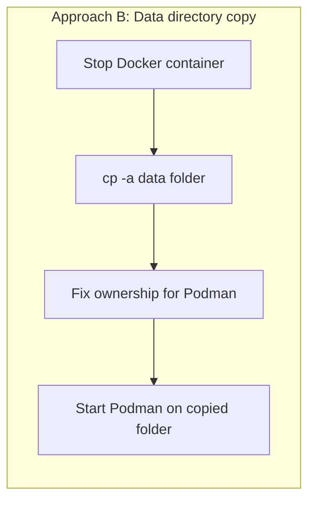

# Docker to Podman Migration — Approach B: Data Directory Copy

> Part of a 3-approach PoC. See [README.md](./README.md) for the overview, analogy, and results across all approaches. Also see [Approach A](./APPROACH-A-DUMP-RESTORE.md) and [Approach C](./APPROACH-C-LOGICAL-REPLICATION.md).

> Self-contained guide. Copy-paste every block in order, top to bottom, on a clean machine. All fixes discovered during Approach A are already baked in below.

---

## Fixes already applied in this guide

These were found during Approach A testing and are pre-applied here so you don't hit them again.

| # | Problem | Cause | Fix applied |
|---|---|---|---|
| 1 | PostgreSQL container exits immediately on start | PostgreSQL 18+ images require the volume mounted at `/var/lib/postgresql`, not `/var/lib/postgresql/data` | Correct mount path used throughout |
| 2 | `podman` container "disappears" between commands | Rootless (`podman`) and rootful (`sudo podman`) store containers in separate, invisible-to-each-other locations | Every migration script refuses to run without `sudo` |
| 3 | Script fails with a path under `/root/...` | `sudo ./script.sh` resets `$HOME` to root's home, breaking any `~` inside the script | Scripts resolve their own location from the script file path — no `~`, no `$HOME`, no hardcoded username |
| 4 | `Error: open /etc/containers/policy.json: no such file or directory` | Some minimal Podman installs don't ship the default trust policy file | `install-podman.sh` creates a default policy file if missing |
| 5 | `docker: command not found` despite `dpkg` showing it installed | Package database out of sync with the actual filesystem | Install script uses `--reinstall` as a safety net |
| 6 | `Error: statfs .../podman-data: no such file or directory` | Docker auto-creates missing host bind-mount directories; Podman does not | Scripts `mkdir -p` the target directory before `podman run` |
| 7 | `Error: please use unshare with rootless` when fixing volume ownership | `podman unshare` only exists to let a rootless (non-root) user act as root inside a temporary namespace. Under `sudo` (rootful) you already are root, so there's no namespace to unshare. | Use a plain `chown -R` instead of `podman unshare chown` when running rootful |

**Approach B has one more known risk area not yet seen in Approach A**: file ownership. Docker and Podman may run the PostgreSQL process under different internal UIDs, so a data directory copied byte-for-byte from Docker may not be readable by Podman's process. This guide treats that as something to observe and document, not something already solved — see Step 6.

---

## 0. Before You Begin: Clean Environment Check

```bash
echo "--- docker ---"
docker ps -a 2>/dev/null || echo "docker not installed yet"
echo "--- podman (rootless) ---"
podman ps -a 2>/dev/null || echo "podman not installed yet"
echo "--- podman (rootful) ---"
sudo podman ps -a 2>/dev/null || echo "podman not installed yet"
```

If anything shows up, wipe it first:

```bash
docker rm -f $(docker ps -aq) 2>/dev/null
docker system prune -a --volumes -f 2>/dev/null

podman rm -af 2>/dev/null
sudo podman rm -af 2>/dev/null
```

---

## 1. What's Different About Approach B

| # | Approach | What actually happens |
|---|---|---|
| A (already done) | Dump & restore | `pg_dump` → file → `pg_restore`. Application-level copy, engine-agnostic. |
| **B (this guide)** | **Data directory copy** | Stop Docker, physically copy the on-disk data folder, fix ownership, point Podman at the copy. Low-level, faster, but touches file permissions directly. |



Because this approach copies files directly instead of going through `pg_dump`, it's the approach most likely to expose a **UID/GID mismatch** between how Docker and Podman run the PostgreSQL process internally. That's the specific thing Step 6 below is designed to surface and document — not assume away.

---

## 2. Install Docker and Podman

```bash
mkdir -p ~/poc-approach-b/{scripts,docker-data,dumps,logs,results}
cd ~/poc-approach-b
```

```bash
cat > scripts/install-docker.sh << 'EOF'
#!/usr/bin/env bash
set -euo pipefail
sudo apt update
sudo apt install -y ca-certificates curl gnupg
sudo install -m 0755 -d /etc/apt/keyrings
curl -fsSL https://download.docker.com/linux/ubuntu/gpg | sudo gpg --dearmor -o /etc/apt/keyrings/docker.gpg
sudo chmod a+r /etc/apt/keyrings/docker.gpg
echo \
  "deb [arch=$(dpkg --print-architecture) signed-by=/etc/apt/keyrings/docker.gpg] https://download.docker.com/linux/ubuntu \
  $(. /etc/os-release && echo "$VERSION_CODENAME") stable" | \
  sudo tee /etc/apt/sources.list.d/docker.list > /dev/null
sudo apt update
sudo apt install -y docker-ce docker-ce-cli containerd.io docker-buildx-plugin docker-compose-plugin
sudo systemctl enable --now docker

# Fix #5: if the binary is missing despite dpkg believing it's installed,
# a plain reinstall repairs it without needing a full purge.
if ! command -v docker >/dev/null 2>&1; then
  echo "docker binary missing after install — forcing reinstall..."
  sudo apt install --reinstall -y docker-ce docker-ce-cli containerd.io
fi
docker --version
EOF
chmod +x scripts/install-docker.sh
./scripts/install-docker.sh
```

```bash
cat > scripts/install-podman.sh << 'EOF'
#!/usr/bin/env bash
set -euo pipefail
sudo apt update
sudo apt install -y podman
podman --version

# Fix #4: some minimal installs don't ship a default trust policy file.
if [[ ! -f /etc/containers/policy.json ]]; then
  echo "policy.json missing — creating default trust policy..."
  sudo mkdir -p /etc/containers
  sudo tee /etc/containers/policy.json > /dev/null << 'POLICYEOF'
{
    "default": [
        { "type": "insecureAcceptAnything" }
    ]
}
POLICYEOF
fi

sudo podman info --format '{{.Host.Security.Rootless}}'
EOF
chmod +x scripts/install-podman.sh
./scripts/install-podman.sh
```

> **Rootful only, from here on.** Every Podman command uses `sudo podman` — see Fix #2.

---

## 3. Start PostgreSQL 19 Beta 2 on Docker

```bash
cat > scripts/start-docker-pg.sh << 'EOF'
#!/usr/bin/env bash
set -euo pipefail
BASE="$(cd "$(dirname "${BASH_SOURCE[0]}")/.." && pwd)"

docker pull postgres:19beta2
docker run -d \
  --name pg19-docker \
  -e POSTGRES_PASSWORD=poc_pass \
  -e POSTGRES_USER=poc_admin \
  -e POSTGRES_DB=poc_db \
  -p 5432:5432 \
  -v "$BASE/docker-data:/var/lib/postgresql" \
  postgres:19beta2
sleep 5
docker exec pg19-docker psql -U poc_admin -d poc_db -c "SELECT version();"
EOF
chmod +x scripts/start-docker-pg.sh
./scripts/start-docker-pg.sh
```

---

## 4. Add Sample Data (Python)

```bash
cat > scripts/requirements.txt << 'EOF'
psycopg2-binary==2.9.9
EOF
python3 -m venv venv
source venv/bin/activate
pip install -r scripts/requirements.txt
```

```bash
cat > scripts/generate_sample_data.py << 'PYEOF'
#!/usr/bin/env python3
import argparse, json, random
from datetime import date, timedelta
import psycopg2
from psycopg2.extras import execute_values

NAMES = ["Arjun Sharma", "Priya Iyer", "Vikram Patel", "Ananya Reddy", "Rohan Nair"]

SCHEMA_SQL = """
CREATE TABLE IF NOT EXISTS customers (
    id SERIAL PRIMARY KEY, name TEXT, email TEXT UNIQUE,
    metadata JSONB, created_at TIMESTAMPTZ DEFAULT now()
);
CREATE TABLE IF NOT EXISTS orders (
    id BIGSERIAL PRIMARY KEY, customer_id INT REFERENCES customers(id),
    amount NUMERIC(12,2), order_date DATE,
    full_price NUMERIC GENERATED ALWAYS AS (amount * 1.18) STORED
);
CREATE EXTENSION IF NOT EXISTS pgcrypto;
"""

def main():
    p = argparse.ArgumentParser()
    p.add_argument("--host", default="localhost")
    p.add_argument("--port", type=int, default=5432)
    p.add_argument("--dbname", default="poc_db")
    p.add_argument("--user", default="poc_admin")
    p.add_argument("--password", default="poc_pass")
    p.add_argument("--customers", type=int, default=1000)
    p.add_argument("--orders", type=int, default=3000)
    args = p.parse_args()

    conn = psycopg2.connect(host=args.host, port=args.port, dbname=args.dbname,
                             user=args.user, password=args.password)
    cur = conn.cursor()
    cur.execute(SCHEMA_SQL)
    conn.commit()

    customers = [(random.choice(NAMES), f"user{i}@example.com",
                  json.dumps({"active": random.choice([True, False])}))
                 for i in range(args.customers)]
    execute_values(cur, "INSERT INTO customers (name,email,metadata) VALUES %s", customers)
    conn.commit()

    today = date.today()
    orders = [(random.randint(1, args.customers), round(random.uniform(10, 5000), 2),
               today - timedelta(days=random.randint(0, 365))) for _ in range(args.orders)]
    execute_values(cur, "INSERT INTO orders (customer_id,amount,order_date) VALUES %s", orders)
    conn.commit()

    cur.execute("SELECT count(*) FROM customers;"); print("customers:", cur.fetchone()[0])
    cur.execute("SELECT count(*) FROM orders;"); print("orders:", cur.fetchone()[0])
    cur.close(); conn.close()
    print("Done.")

if __name__ == "__main__":
    main()
PYEOF
chmod +x scripts/generate_sample_data.py
python3 scripts/generate_sample_data.py
```

---

## 5. Check the Internal UID Before Migrating

Approach A never needed this — `pg_dump`/`pg_restore` don't care about file ownership. Approach B copies files directly, so find out what UID PostgreSQL actually runs as inside the image before copying anything:

```bash
docker run --rm postgres:19beta2 id postgres
```

Note the UID/GID printed (commonly `999:999` for the official Postgres image, but confirm rather than assume — this is exactly the kind of thing to verify, not guess).

---

## 6. Migrate: Approach B (Data Directory Copy)

```bash
cat > scripts/migrate-approach-b.sh << 'EOF'
#!/usr/bin/env bash
set -euo pipefail
if [[ $EUID -ne 0 ]]; then
  echo "Run with sudo — this PoC uses rootful Podman only." >&2
  exit 1
fi
BASE="$(cd "$(dirname "${BASH_SOURCE[0]}")/.." && pwd)"
PG_UID="${1:-999}"
PG_GID="${2:-999}"

echo "[1/5] Stopping Docker source cleanly..."
docker stop pg19-docker

echo "[2/5] Copying data directory..."
mkdir -p "$BASE/podman-data"
cp -a "$BASE/docker-data/." "$BASE/podman-data/"

echo "[3/5] Fixing ownership for Podman (UID:GID = $PG_UID:$PG_GID)..."
# Note: `podman unshare` is a rootless-only tool — it creates a user namespace
# so an unprivileged user can chown as if root. Under sudo (rootful), we
# already ARE root, so a plain chown is correct here.
chown -R "$PG_UID:$PG_GID" "$BASE/podman-data"

echo "[4/5] Starting Podman target on copied data dir..."
podman run -d \
  --name pg19-podman-b \
  -p 5434:5432 \
  -v "$BASE/podman-data:/var/lib/postgresql" \
  docker.io/library/postgres:19beta2
sleep 5

echo "[5/5] Checking logs for permission errors..."
podman logs pg19-podman-b | tail -n 40
EOF
chmod +x scripts/migrate-approach-b.sh
sudo ./scripts/migrate-approach-b.sh 999 999
```

> Pass the UID/GID you found in Step 5 as arguments if it wasn't `999:999`: `sudo ./scripts/migrate-approach-b.sh <uid> <gid>`.

**Document, don't assume:** whatever Step [5/5] prints — clean startup or a permission error — that output is your real finding, not a guess. Save it:

```bash
mkdir -p results
podman logs pg19-podman-b > results/approach-b-log.txt 2>&1
```

---

## 7. Verify

```bash
echo "Docker count (source, still stopped):"
docker start pg19-docker && sleep 3
docker exec pg19-docker psql -U poc_admin -d poc_db -tAc "SELECT count(*) FROM customers;"

echo "Podman count (Approach B target):"
sudo podman exec pg19-podman-b psql -U poc_admin -d poc_db -tAc "SELECT count(*) FROM customers;"
```

Both numbers must match.

---

## 8. Cleanup (Run at the End)

Same full-uninstall teardown as Approach A — removes containers, images, volumes, and **uninstalls Docker and Podman themselves**.

```bash
cat > scripts/full-poc-teardown.sh << 'EOF'
#!/usr/bin/env bash
set -uo pipefail
BASE="$(cd "$(dirname "${BASH_SOURCE[0]}")/.." && pwd)"

read -rp "This will fully UNINSTALL Docker and Podman and delete $BASE. Continue? [y/N] " confirm
[[ "$confirm" == "y" || "$confirm" == "Y" ]] || { echo "Aborted."; exit 0; }

docker stop $(docker ps -aq) 2>/dev/null || true
docker rm -f $(docker ps -aq) 2>/dev/null || true
docker rmi -f $(docker images -q) 2>/dev/null || true
docker volume rm $(docker volume ls -q) 2>/dev/null || true
docker network prune -f 2>/dev/null || true
sudo systemctl stop docker.socket docker.service 2>/dev/null || true
sudo systemctl disable docker.socket docker.service 2>/dev/null || true
sudo rm -f /etc/systemd/system/docker.service /etc/systemd/system/docker.socket
sudo apt purge -y docker docker-ce docker-ce-cli docker-engine docker.io \
  containerd containerd.io docker-buildx-plugin docker-compose-plugin \
  docker-ce-rootless-extras runc 2>/dev/null || true
sudo rm -rf /var/lib/docker /var/lib/containerd ~/.docker

podman stop --all 2>/dev/null || true
podman rm --all --force 2>/dev/null || true
podman rmi --all --force 2>/dev/null || true
podman volume rm --all --force 2>/dev/null || true
sudo podman stop --all 2>/dev/null || true
sudo podman rm --all --force 2>/dev/null || true
sudo podman rmi --all --force 2>/dev/null || true
sudo podman volume rm --all --force 2>/dev/null || true
systemctl --user stop podman.socket podman.service 2>/dev/null || true
sudo systemctl stop podman.socket podman.service 2>/dev/null || true
sudo apt purge -y podman 2>/dev/null || true
rm -rf ~/.local/share/containers ~/.config/containers
sudo rm -rf /var/lib/containers

sudo rm -f /etc/apt/sources.list.d/docker.list /etc/apt/keyrings/docker.gpg
sudo apt update
sudo rm -f /usr/bin/docker /usr/bin/podman

deactivate 2>/dev/null || true
cd /tmp
rm -rf "$BASE"

command -v docker >/dev/null 2>&1 && echo "WARNING: docker still present" || echo "Docker fully removed"
command -v podman >/dev/null 2>&1 && echo "WARNING: podman still present" || echo "Podman fully removed"
echo "Done."
EOF
chmod +x scripts/full-poc-teardown.sh
./scripts/full-poc-teardown.sh
```

---

## Confirmed Results (This Run)

| Check | Result |
|---|---|
| Internal UID/GID (`docker run --rm postgres:19beta2 id postgres`) | `999:999` |
| UID mismatch encountered? | No — matched on the first attempt in this environment |
| `[5/5]` log check | Clean startup, no permission errors |
| Docker customer count | 1000 |
| Podman customer count | 1000 |
| Match | ✅ Yes |
| Issue specific to this approach | `podman unshare chown` fails under rootful (`sudo`) — it's rootless-only; plain `chown -R` is the correct rootful equivalent (Fix #7) |

> **Honest caveat:** the UID-mismatch risk this approach is known for didn't actually manifest here — `999:999` matched cleanly on both engines. That's a valid result, not a guarantee it won't happen in a different environment; treat this as "not observed in this run," not "solved in general."

## What's Next

- [Approach C](./APPROACH-C-LOGICAL-REPLICATION.md) — logical replication, the near-zero-downtime path, most advanced
- The full test matrix (extensions, partitions, generated columns, sequences)
- Performance benchmarking with `pgbench`
