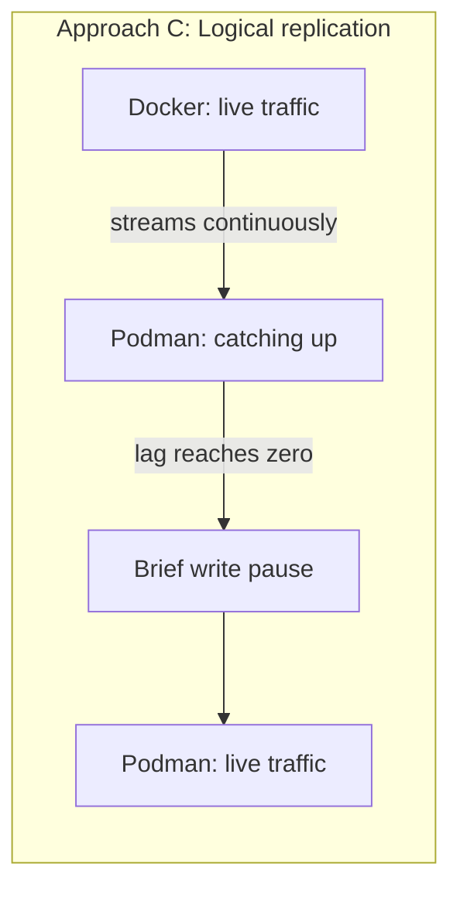

# Docker to Podman Migration — Approach C: Logical Replication (Near-Zero Downtime)

> Part of a 3-approach PoC. See [README.md](./README.md) for the overview, analogy, and results across all approaches. Also see [Approach A](./APPROACH-A-DUMP-RESTORE.md) and [Approach B](./APPROACH-B-DATA-DIR-COPY.md).

> Self-contained guide. Copy-paste every block in order, top to bottom, on a clean machine. All fixes discovered during Approaches A and B are already baked in below.

---

## Fixes already applied in this guide

| # | Problem | Cause | Fix applied |
|---|---|---|---|
| 1 | PostgreSQL container exits immediately on start | PostgreSQL 18+ images require the volume mounted at `/var/lib/postgresql`, not `/var/lib/postgresql/data` | Correct mount path used throughout |
| 2 | `podman` container "disappears" between commands | Rootless (`podman`) and rootful (`sudo podman`) store containers separately | Every migration script refuses to run without `sudo` |
| 3 | Script fails with a path under `/root/...` | `sudo ./script.sh` resets `$HOME`, breaking `~` | Scripts resolve their own location from the script file path |
| 4 | `Error: open /etc/containers/policy.json: no such file or directory` | Minimal Podman installs may not ship the default trust policy | `install-podman.sh` creates a default policy file if missing |
| 5 | `docker: command not found` despite `dpkg` showing it installed | Package database out of sync with the filesystem | Install script uses `--reinstall` as a safety net |
| 6 | `Error: statfs .../podman-data: no such file or directory` | Docker auto-creates missing bind-mount host dirs; Podman does not | Scripts `mkdir -p` the target directory before `podman run` |
| 7 | `Error: please use unshare with rootless` | `podman unshare` is rootless-only — under `sudo` you're already root | Plain `chown -R` used instead |
| 8 | `connection to server at "<old-ip>" ... Connection timed out` when refreshing/using an existing subscription | WSL2's host IP address can change between sessions (network reconnect, sleep/wake, DHCP renewal) — this is WSL2-specific, not a Docker/Podman issue | Re-check `hostname -I`, confirm reachability, then `ALTER SUBSCRIPTION poc_sub CONNECTION '...'` to update the address before `REFRESH PUBLICATION` |
| 9 | `ERROR: relation "public.<table>" does not exist` when running `ALTER SUBSCRIPTION ... REFRESH PUBLICATION` | A new table created on the Docker source doesn't exist on the Podman subscriber. Logical replication never creates schema — `REFRESH PUBLICATION` only updates the *list* of tables to watch, it can't attach a table that isn't there. | `pg_dump --schema-only -t <table>` from Docker, restore it on Podman, **then** run `REFRESH PUBLICATION` — see Step 7b |
| 10 | New column added on Docker doesn't appear on Podman — no error, data is just silently missing | Logical replication matches columns by name. A column that exists only on the publisher is dropped in transit; nothing breaks, but the value never arrives. | `ALTER TABLE ... ADD COLUMN` manually on Podman with the same name/type. No `REFRESH PUBLICATION` needed for column changes (unlike new tables). Rows replicated *before* the fix are not backfilled automatically — see Step 7c |

**Approach C has a new risk area not present in A or B: cross-engine networking.** Docker and Podman each run their own separate bridge network. This guide does not assume they can reach each other — Step 6 explicitly tests connectivity before creating the replication subscription, and documents whichever address actually works.

---

## 0. Before You Begin: Clean Environment Check

```bash
echo "--- docker ---"
docker ps -a 2>/dev/null || echo "docker not installed yet"
echo "--- podman (rootless) ---"
podman ps -a 2>/dev/null || echo "podman not installed yet"
echo "--- podman (rootful) ---"
sudo podman ps -a 2>/dev/null || echo "podman not installed yet"
```

```bash
docker rm -f $(docker ps -aq) 2>/dev/null
docker system prune -a --volumes -f 2>/dev/null
podman rm -af 2>/dev/null
sudo podman rm -af 2>/dev/null
```

---

## 1. What's Different About Approach C

| # | Approach | What actually happens |
|---|---|---|
| A | Dump & restore | `pg_dump` → file → `pg_restore`. Both engines never run at the same time doing real work together. |
| B | Data directory copy | Docker stops, files copied, Podman starts. Sequential — never both live at once. |
| **C (this guide)** | **Logical replication** | **Both engines run at the same time.** Docker keeps serving live traffic while Podman continuously receives changes, until a short cutover pause flips traffic over. |



This is the only approach where downtime is measured in **seconds**, not minutes — but it's also the most operationally involved, since two databases must talk to each other across two different container networks.

---

## 2. Install Docker and Podman

```bash
mkdir -p ~/poc-approach-c/{scripts,docker-data,dumps,logs,results}
cd ~/poc-approach-c
```

```bash
cat > scripts/install-docker.sh << 'EOF'
#!/usr/bin/env bash
set -euo pipefail
sudo apt update
sudo apt install -y ca-certificates curl gnupg
sudo install -m 0755 -d /etc/apt/keyrings
curl -fsSL https://download.docker.com/linux/ubuntu/gpg | sudo gpg --dearmor -o /etc/apt/keyrings/docker.gpg
sudo chmod a+r /etc/apt/keyrings/docker.gpg
echo \
  "deb [arch=$(dpkg --print-architecture) signed-by=/etc/apt/keyrings/docker.gpg] https://download.docker.com/linux/ubuntu \
  $(. /etc/os-release && echo "$VERSION_CODENAME") stable" | \
  sudo tee /etc/apt/sources.list.d/docker.list > /dev/null
sudo apt update
sudo apt install -y docker-ce docker-ce-cli containerd.io docker-buildx-plugin docker-compose-plugin
sudo systemctl enable --now docker
if ! command -v docker >/dev/null 2>&1; then
  echo "docker binary missing after install — forcing reinstall..."
  sudo apt install --reinstall -y docker-ce docker-ce-cli containerd.io
fi
docker --version
EOF
chmod +x scripts/install-docker.sh
./scripts/install-docker.sh
```

```bash
cat > scripts/install-podman.sh << 'EOF'
#!/usr/bin/env bash
set -euo pipefail
sudo apt update
sudo apt install -y podman
podman --version
if [[ ! -f /etc/containers/policy.json ]]; then
  echo "policy.json missing — creating default trust policy..."
  sudo mkdir -p /etc/containers
  sudo tee /etc/containers/policy.json > /dev/null << 'POLICYEOF'
{
    "default": [
        { "type": "insecureAcceptAnything" }
    ]
}
POLICYEOF
fi
sudo podman info --format '{{.Host.Security.Rootless}}'
EOF
chmod +x scripts/install-podman.sh
./scripts/install-podman.sh
```

> **Rootful only, from here on.** Every Podman command uses `sudo podman`.

---

## 3. Start PostgreSQL 19 Beta 2 on Docker

```bash
cat > scripts/start-docker-pg.sh << 'EOF'
#!/usr/bin/env bash
set -euo pipefail
BASE="$(cd "$(dirname "${BASH_SOURCE[0]}")/.." && pwd)"

docker pull postgres:19beta2
docker run -d \
  --name pg19-docker \
  -e POSTGRES_PASSWORD=poc_pass \
  -e POSTGRES_USER=poc_admin \
  -e POSTGRES_DB=poc_db \
  -p 5432:5432 \
  -v "$BASE/docker-data:/var/lib/postgresql" \
  postgres:19beta2
sleep 5
docker exec pg19-docker psql -U poc_admin -d poc_db -c "SELECT version();"
EOF
chmod +x scripts/start-docker-pg.sh
./scripts/start-docker-pg.sh
```

---

## 4. Add Sample Data (Python)

```bash
cat > scripts/requirements.txt << 'EOF'
psycopg2-binary==2.9.9
EOF
python3 -m venv venv
source venv/bin/activate
pip install -r scripts/requirements.txt
```

```bash
cat > scripts/generate_sample_data.py << 'PYEOF'
#!/usr/bin/env python3
import argparse, json, random
from datetime import date, timedelta
import psycopg2
from psycopg2.extras import execute_values

NAMES = ["Arjun Sharma", "Priya Iyer", "Vikram Patel", "Ananya Reddy", "Rohan Nair"]

SCHEMA_SQL = """
CREATE TABLE IF NOT EXISTS customers (
    id SERIAL PRIMARY KEY, name TEXT, email TEXT UNIQUE,
    metadata JSONB, created_at TIMESTAMPTZ DEFAULT now()
);
CREATE TABLE IF NOT EXISTS orders (
    id BIGSERIAL PRIMARY KEY, customer_id INT REFERENCES customers(id),
    amount NUMERIC(12,2), order_date DATE,
    full_price NUMERIC GENERATED ALWAYS AS (amount * 1.18) STORED
);
CREATE EXTENSION IF NOT EXISTS pgcrypto;
"""

def main():
    p = argparse.ArgumentParser()
    p.add_argument("--host", default="localhost")
    p.add_argument("--port", type=int, default=5432)
    p.add_argument("--dbname", default="poc_db")
    p.add_argument("--user", default="poc_admin")
    p.add_argument("--password", default="poc_pass")
    p.add_argument("--customers", type=int, default=1000)
    p.add_argument("--orders", type=int, default=3000)
    args = p.parse_args()

    conn = psycopg2.connect(host=args.host, port=args.port, dbname=args.dbname,
                             user=args.user, password=args.password)
    cur = conn.cursor()
    cur.execute(SCHEMA_SQL)
    conn.commit()

    customers = [(random.choice(NAMES), f"user{i}@example.com",
                  json.dumps({"active": random.choice([True, False])}))
                 for i in range(args.customers)]
    execute_values(cur, "INSERT INTO customers (name,email,metadata) VALUES %s", customers)
    conn.commit()

    today = date.today()
    orders = [(random.randint(1, args.customers), round(random.uniform(10, 5000), 2),
               today - timedelta(days=random.randint(0, 365))) for _ in range(args.orders)]
    execute_values(cur, "INSERT INTO orders (customer_id,amount,order_date) VALUES %s", orders)
    conn.commit()

    cur.execute("SELECT count(*) FROM customers;"); print("customers:", cur.fetchone()[0])
    cur.execute("SELECT count(*) FROM orders;"); print("orders:", cur.fetchone()[0])
    cur.close(); conn.close()
    print("Done.")

if __name__ == "__main__":
    main()
PYEOF
chmod +x scripts/generate_sample_data.py
python3 scripts/generate_sample_data.py
```

---

## 5. Enable Logical Replication and Start the Podman Target (Schema Only)

```bash
cat > scripts/setup-replication.sh << 'EOF'
#!/usr/bin/env bash
set -euo pipefail
if [[ $EUID -ne 0 ]]; then
  echo "Run with sudo — this PoC uses rootful Podman only." >&2
  exit 1
fi
BASE="$(cd "$(dirname "${BASH_SOURCE[0]}")/.." && pwd)"

echo "[1/5] Enabling logical replication on Docker source..."
docker exec pg19-docker psql -U poc_admin -d poc_db -c "ALTER SYSTEM SET wal_level = logical;"
docker restart pg19-docker
sleep 5

echo "[2/5] Creating publication..."
docker exec pg19-docker psql -U poc_admin -d poc_db -c "CREATE PUBLICATION poc_pub FOR ALL TABLES;"

echo "[3/5] Schema-only dump for target..."
docker exec pg19-docker pg_dump -U poc_admin --schema-only poc_db > "$BASE/dumps/poc_db_schema.dump"

echo "[4/5] Starting Podman target (schema only, no data yet)..."
mkdir -p "$BASE/podman-data"
podman run -d \
  --name pg19-podman-c \
  -e POSTGRES_PASSWORD=poc_pass -e POSTGRES_USER=poc_admin -e POSTGRES_DB=poc_db \
  -p 5435:5432 \
  -v "$BASE/podman-data:/var/lib/postgresql" \
  docker.io/library/postgres:19beta2
sleep 5

echo "[5/5] Restoring schema (no data) into Podman..."
podman exec -i pg19-podman-c psql -U poc_admin -d poc_db < "$BASE/dumps/poc_db_schema.dump"

echo "Done. Docker keeps running with live data; Podman has schema only, ready to subscribe."
EOF
chmod +x scripts/setup-replication.sh
sudo ./scripts/setup-replication.sh
```

---

## 6. Test Cross-Engine Connectivity (Don't Assume It Works)

Docker and Podman each run their own separate bridge network. Before creating the subscription, confirm the Podman container can actually reach the Docker container.

```bash
cat > scripts/find-source-address.sh << 'EOF'
#!/usr/bin/env bash
set -euo pipefail
echo "Docker container's bridge IP:"
DOCKER_IP=$(docker inspect pg19-docker --format '{{range .NetworkSettings.Networks}}{{.IPAddress}}{{end}}')
echo "  $DOCKER_IP"

echo "Testing reachability from inside the Podman container..."
if sudo podman exec pg19-podman-c bash -c "echo > /dev/tcp/$DOCKER_IP/5432" 2>/dev/null; then
  echo "REACHABLE via Docker bridge IP: $DOCKER_IP"
  echo "$DOCKER_IP" > /tmp/poc-source-address.txt
else
  echo "NOT reachable via Docker bridge IP — falling back to the host's own address."
  HOST_IP=$(hostname -I | awk '{print $1}')
  echo "  Trying host IP: $HOST_IP (Docker's port 5432 is published to the host)"
  if sudo podman exec pg19-podman-c bash -c "echo > /dev/tcp/$HOST_IP/5432" 2>/dev/null; then
    echo "REACHABLE via host IP: $HOST_IP"
    echo "$HOST_IP" > /tmp/poc-source-address.txt
  else
    echo "NEITHER address is reachable — this is a real finding, not a script bug."
    echo "Record this in your results before troubleshooting further."
  fi
fi
EOF
chmod +x scripts/find-source-address.sh
./scripts/find-source-address.sh
cat /tmp/poc-source-address.txt 2>/dev/null || echo "No working address found — see output above."
```

**Document, don't assume:** whichever address worked (or didn't) is real evidence for your article's networking section — don't paper over it.

> **WSL2-specific risk:** the host IP found here can change later in the same PoC session (network reconnect, sleep/wake). If a later step reports a connection timeout to an address that worked before, re-run the reachability check rather than assuming the earlier fix has broken — see Fix #8.

---

## 7. Create the Subscription and Watch Replication Lag

```bash
SOURCE_ADDR=$(cat /tmp/poc-source-address.txt)
echo "Using source address: $SOURCE_ADDR"

sudo podman exec pg19-podman-c psql -U poc_admin -d poc_db -c \
  "CREATE SUBSCRIPTION poc_sub CONNECTION 'host=$SOURCE_ADDR port=5432 dbname=poc_db user=poc_admin password=poc_pass' PUBLICATION poc_pub;"
```

Watch replication status until `srsubstate` shows `r` (ready/streaming) for every table:

```bash
watch -n 2 "docker exec pg19-docker psql -U poc_admin -d poc_db -c '\x' -c \"SELECT application_name, state, sent_lsn, write_lsn, flush_lsn, replay_lsn, write_lag, flush_lag, replay_lag, sync_state, reply_time FROM pg_stat_replication;\" && sudo podman exec pg19-podman-c psql -U poc_admin -d poc_db -c \"SELECT * FROM pg_subscription_rel;\""
```

Press `Ctrl+C` once every row shows `r`.

Confirm the row counts already match:

```bash
echo "Docker (source):"
docker exec pg19-docker psql -U poc_admin -d poc_db -tAc "SELECT count(*) FROM customers;"
echo "Podman (subscriber, still syncing/synced):"
sudo podman exec pg19-podman-c psql -U poc_admin -d poc_db -tAc "SELECT count(*) FROM customers;"
```

### 7a. Test DML Replication (should work live)

```bash
docker exec pg19-docker psql -U poc_admin -d poc_db -c \
  "INSERT INTO customers (name, email, metadata) VALUES ('Test User', 'ddl-test@example.com', '{\"active\": true}');"

sleep 2
echo "Row count on Podman after a live INSERT on Docker:"
sudo podman exec pg19-podman-c psql -U poc_admin -d poc_db -tAc "SELECT count(*) FROM customers WHERE email = 'ddl-test@example.com';"
```

Expect `1` — DML (INSERT/UPDATE/DELETE) on already-subscribed tables replicates automatically and continuously.

### 7b. Test DDL Replication (known limitation — expect this NOT to replicate)

```bash
echo "Adding a new table on Docker source..."
docker exec pg19-docker psql -U poc_admin -d poc_db -c \
  "CREATE TABLE ddl_test (id SERIAL PRIMARY KEY, note TEXT);"

echo "Checking if it shows up on Podman (expected: it will NOT)..."
sudo podman exec pg19-podman-c psql -U poc_admin -d poc_db -c "\dt ddl_test" 2>&1
```

**This is expected to fail to find the table** — logical replication only ships DML, never DDL. New tables and altered structures never propagate automatically, regardless of `FOR ALL TABLES`. To actually bring a new table into replication:

```bash
echo "Manually mirroring the DDL on Podman..."
sudo podman exec pg19-podman-c psql -U poc_admin -d poc_db -c \
  "CREATE TABLE ddl_test (id SERIAL PRIMARY KEY, note TEXT);"

echo "Refreshing the subscription so it picks up the new table..."
sudo podman exec pg19-podman-c psql -U poc_admin -d poc_db -c \
  "ALTER SUBSCRIPTION poc_sub REFRESH PUBLICATION;"

echo "Now test DML on the new table..."
docker exec pg19-docker psql -U poc_admin -d poc_db -c \
  "INSERT INTO ddl_test (note) VALUES ('replicated after manual schema sync');"
sleep 2
sudo podman exec pg19-podman-c psql -U poc_admin -d poc_db -tAc "SELECT count(*) FROM ddl_test;"
```

Expect `1` now — proving the table replicates fine for DML *once* its schema is manually mirrored and the subscription refreshed. This confirms the limitation is specifically DDL propagation, not a broader replication failure.

### 7c. Test Column Addition on an Already-Subscribed Table (different from 7b)

Adding a column to a table that's already replicating (like `customers`) behaves differently from adding a brand-new table — no `REFRESH PUBLICATION` needed here, since the table itself is already known to the subscription.

```bash
echo "1. Add a column on Docker (source)..."
docker exec pg19-docker psql -U poc_admin -d poc_db -c \
  "ALTER TABLE customers ADD COLUMN phone TEXT;"

echo "2. Insert a row with the new column filled..."
docker exec pg19-docker psql -U poc_admin -d poc_db -c \
  "INSERT INTO customers (name, email, metadata, phone) VALUES ('Phone Test', 'phone-test@example.com', '{\"active\": true}', '9999999999');"
sleep 2

echo "3. Check Podman — row exists, but WITHOUT the phone value (column doesn't exist there yet, silently dropped, no error)..."
sudo podman exec pg19-podman-c psql -U poc_admin -d poc_db -c \
  "SELECT id, name, email FROM customers WHERE email = 'phone-test@example.com';"

echo "4. Mirror the column on Podman..."
sudo podman exec pg19-podman-c psql -U poc_admin -d poc_db -c \
  "ALTER TABLE customers ADD COLUMN phone TEXT;"

echo "5. Insert another row on Docker AFTER the column exists on both sides..."
docker exec pg19-docker psql -U poc_admin -d poc_db -c \
  "INSERT INTO customers (name, email, metadata, phone) VALUES ('Phone Test 2', 'phone-test-2@example.com', '{\"active\": true}', '8888888888');"
sleep 2

echo "6. This one replicates WITH the phone value..."
sudo podman exec pg19-podman-c psql -U poc_admin -d poc_db -c \
  "SELECT id, name, email, phone FROM customers WHERE email = 'phone-test-2@example.com';"

echo "7. Confirm the first row's phone is still NULL on Podman — no automatic backfill for rows replicated before the column existed on both sides..."
sudo podman exec pg19-podman-c psql -U poc_admin -d poc_db -c \
  "SELECT id, name, email, phone FROM customers WHERE email = 'phone-test@example.com';"
```

Summary of the two DDL cases:

| Change | Needs `REFRESH PUBLICATION`? | Needs manual schema mirror? | Backfill for old rows? |
|---|---|---|---|
| New table (7b) | Yes | Yes, before refresh | N/A — table is new |
| New column on existing table (7c) | No | Yes | No — manual `UPDATE` required if needed |

---

## 8. Cutover (Record the Actual Downtime Here)

This is the only step in this guide with real downtime — everything before it happened with both databases live. Time it.

```bash
echo "Cutover started at: $(date -u +%H:%M:%S)"

# In production this is where you'd pause the application's writes.
# For this PoC, we just confirm lag is zero and disable the subscription.
docker exec pg19-docker psql -U poc_admin -c "SELECT slot_name, active FROM pg_replication_slots;"

sudo podman exec pg19-podman-c psql -U poc_admin -d poc_db -c "ALTER SUBSCRIPTION poc_sub DISABLE;"

echo "Cutover finished at: $(date -u +%H:%M:%S)"
echo "Repoint your application's connection string to the Podman target now (port 5435)."
```

Record the elapsed time between the two timestamps printed above — that's Approach C's actual, measured downtime figure.

---

## 9. Verify

```bash
echo "Docker count:"
docker exec pg19-docker psql -U poc_admin -d poc_db -tAc "SELECT count(*) FROM customers;"
echo "Podman count:"
sudo podman exec pg19-podman-c psql -U poc_admin -d poc_db -tAc "SELECT count(*) FROM customers;"
```

Both numbers must match.

---

## 10. Cleanup (Run at the End)

Full uninstall — same as Approaches A and B.

```bash
cat > scripts/full-poc-teardown.sh << 'EOF'
#!/usr/bin/env bash
set -uo pipefail
BASE="$(cd "$(dirname "${BASH_SOURCE[0]}")/.." && pwd)"

read -rp "This will fully UNINSTALL Docker and Podman and delete $BASE. Continue? [y/N] " confirm
case "$confirm" in
  y|Y|yes|YES|Yes) ;;
  *) echo "Aborted."; exit 0 ;;
esac

docker stop $(docker ps -aq) 2>/dev/null || true
docker rm -f $(docker ps -aq) 2>/dev/null || true
docker rmi -f $(docker images -q) 2>/dev/null || true
docker volume rm $(docker volume ls -q) 2>/dev/null || true
docker network prune -f 2>/dev/null || true
sudo systemctl stop docker.socket docker.service 2>/dev/null || true
sudo systemctl disable docker.socket docker.service 2>/dev/null || true
sudo rm -f /etc/systemd/system/docker.service /etc/systemd/system/docker.socket
sudo apt purge -y docker docker-ce docker-ce-cli docker-engine docker.io \
  containerd containerd.io docker-buildx-plugin docker-compose-plugin \
  docker-ce-rootless-extras runc 2>/dev/null || true
sudo rm -rf /var/lib/docker /var/lib/containerd ~/.docker

podman stop --all 2>/dev/null || true
podman rm --all --force 2>/dev/null || true
podman rmi --all --force 2>/dev/null || true
podman volume rm --all --force 2>/dev/null || true
sudo podman stop --all 2>/dev/null || true
sudo podman rm --all --force 2>/dev/null || true
sudo podman rmi --all --force 2>/dev/null || true
sudo podman volume rm --all --force 2>/dev/null || true
systemctl --user stop podman.socket podman.service 2>/dev/null || true
sudo systemctl stop podman.socket podman.service 2>/dev/null || true
sudo apt purge -y podman 2>/dev/null || true
rm -rf ~/.local/share/containers ~/.config/containers
sudo rm -rf /var/lib/containers

sudo rm -f /etc/apt/sources.list.d/docker.list /etc/apt/keyrings/docker.gpg
sudo apt update
sudo rm -f /usr/bin/docker /usr/bin/podman

echo "Removing Python virtual environment and PoC working directory..."
cd /tmp

# Plain rm first; some files (e.g. from rootful container writes) may need
# sudo to remove. Fall back to sudo rm -rf if the plain attempt leaves
# anything behind, instead of failing silently under `set -uo pipefail`.
rm -rf "$BASE" 2>/dev/null
if [[ -d "$BASE" ]]; then
  echo "Plain rm left files behind (likely root-owned) — retrying with sudo..."
  sudo rm -rf "$BASE"
fi

echo "== Verification =="
command -v docker >/dev/null 2>&1 && echo "WARNING: docker still present" || echo "Docker fully removed"
command -v podman >/dev/null 2>&1 && echo "WARNING: podman still present" || echo "Podman fully removed"
if [[ -d "$BASE" ]]; then
  echo "WARNING: $BASE still exists"
else
  echo "$BASE fully removed (including venv)"
fi
echo "Done."
EOF
chmod +x scripts/full-poc-teardown.sh
./scripts/full-poc-teardown.sh
```

---

## Confirmed Results (This Run)

| Check | Result |
|---|---|
| Docker bridge IP reachable from Podman container? | No |
| Host IP reachable from Podman container? | Yes — used for the subscription connection |
| Live DML replication (Step 7a) | ✅ Confirmed working — INSERT on Docker appeared on Podman within seconds |
| New table replication (Step 7b) | Requires manual schema mirror + `REFRESH PUBLICATION` — does not happen automatically |
| New column replication (Step 7c) | Requires manual `ALTER TABLE` on subscriber — no `REFRESH PUBLICATION` needed, no automatic backfill for previously-replicated rows |
| WSL2 host IP drift | Encountered mid-session — an already-working subscription started timing out after the host's IP changed; fixed by updating `ALTER SUBSCRIPTION ... CONNECTION` to the new address |
| Final row count match | ✅ Yes |

> **Not precisely timed in this run:** the exact cutover downtime (Step 8) wasn't captured with hard timestamps in this session. If reproducing, record the `date -u +%H:%M:%S` output on both sides of Step 8 for a real number — the mechanism to do so is already built into that step.

## What's Next

- Compare all three approaches' actual downtime side by side once Approach C's cutover is precisely timed
- The full test matrix (extensions, partitions, generated columns, sequences)
- Performance benchmarking with `pgbench` across all three targets
- A rootless-vs-rootful comparison pass, since this PoC standardized on rootful throughout
