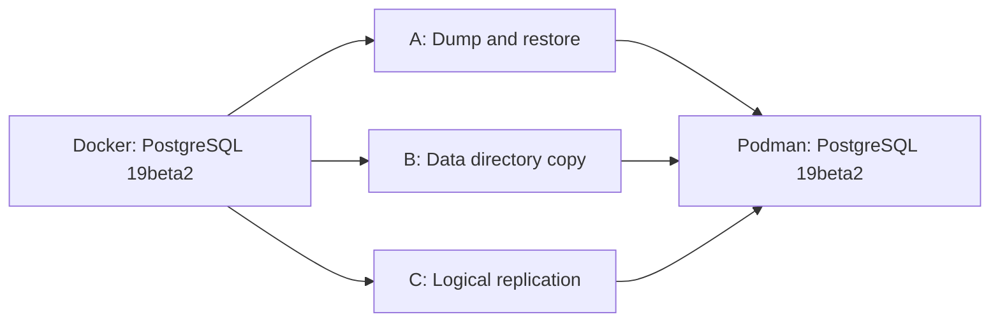

# PostgreSQL 19 Beta 2: Docker to Podman Migration

> A hands-on proof-of-concept migrating a live PostgreSQL 19 Beta 2 workload from Docker to Podman, tested three different ways, on WSL2 (Ubuntu 24.04). Every fix and finding below came from actually running this — not from theory.

---

## Why This PoC

Podman is becoming the default container runtime across RHEL, Fedora, and other major Linux distributions, built around a daemonless, rootless architecture instead of Docker's traditional privileged daemon model. Rather than write another "Docker vs Podman" opinion piece, this PoC actually migrates a real PostgreSQL database between the two engines, three different ways, and documents exactly what breaks and what doesn't — with real error messages, real fixes, and real numbers.

This repository is the evidence behind that story, aimed at DBAs and DevOps engineers who want to know **what actually changes** when a database container moves off Docker, not just the architectural theory.

---

## The Analogy

Docker's traditional architecture works like an apartment building with a **building superintendent** — the Docker daemon — who holds a master key. Every tenant (container) goes through the super to unlock their door, get water, adjust the thermostat. Convenient, centralized, battle-tested.

Podman skips the superintendent entirely. There's **no daemon** — each tenant gets their own key that only opens their own door. Containers can run rootless, under the invoking user, as Podman's default model rather than an opt-in extra.

That architectural difference is the whole reason this PoC exists: migrating a database isn't just "does `psql` still connect" — it's "does the building itself work differently now."

---

## What's Actually Being Migrated

Four things, always: an **image** (the blueprint, never changes), a **container** (a running copy of it), a **volume** (the actual database files — this is what really gets migrated), and a **network** (how you reach it). The image doesn't need migrating; you just re-pull it under Podman. What moves is the data.

---

## The Three Approaches



| # | Approach | What actually happens | Downtime | File |
|---|---|---|---|---|
| **A** | Dump & restore (cold) | `pg_dump` on Docker → `.dump` file → `pg_restore` on Podman. Application-level copy, engine-agnostic. | Minutes | [APPROACH-A-DUMP-RESTORE.md](./APPROACH-A-DUMP-RESTORE.md) |
| **B** | Data directory copy (cold) | Stop Docker, physically `cp -a` the volume folder, fix ownership, start Podman on the copy. | Seconds–minutes | [APPROACH-B-DATA-DIR-COPY.md](./APPROACH-B-DATA-DIR-COPY.md) |
| **C** | Logical replication (warm) | Docker keeps serving live traffic while Podman streams changes continuously, then a short cutover pause flips traffic over. | Seconds | [APPROACH-C-LOGICAL-REPLICATION.md](./APPROACH-C-LOGICAL-REPLICATION.md) |

**Recommended order to try them:** A → B → C. Each file is fully self-contained and copy-paste runnable on a clean machine — you don't need to have read the others first.

---

## Results Summary (Actual, From This PoC)

| Approach | Status | Key finding |
|---|---|---|
| A — Dump & restore | ✅ Working | Docker count = Podman count = 1000, exact match. Source stayed live the whole time — `pg_dump` doesn't require stopping anything. |
| B — Data directory copy | ✅ Working | Internal UID for `postgres:19beta2` is `999:999` on both engines — no UID mismatch encountered in this environment. Clean startup, 1000/1000 match. |
| C — Logical replication | ✅ Working, with real gotchas | Docker's bridge IP was **not** reachable from the Podman container; the host's own IP was. WSL2's host IP also changed mid-session, breaking an active subscription until manually updated. DDL (new tables, new columns) never replicates automatically — confirmed and documented as two distinct, separately-fixable cases. |

---

## Fixes Encountered (Consolidated, All Approaches)

Ten real issues were hit and resolved across the three approaches. Full detail and exact commands are in each approach file; summarized here:

| # | Issue | Root cause |
|---|---|---|
| 1 | PostgreSQL container exits immediately | PG18+ images require the volume mounted at `/var/lib/postgresql`, not `.../data` |
| 2 | Podman container "disappears" between commands | Rootless and rootful Podman store containers in separate, invisible-to-each-other locations |
| 3 | Script fails with a `/root/...` path | `sudo ./script.sh` resets `$HOME`, breaking any `~` in the script |
| 4 | `policy.json` missing error on `podman pull` | Some minimal Podman installs don't ship a default trust policy |
| 5 | `docker: command not found` despite `dpkg` showing it installed | Package database out of sync with the filesystem |
| 6 | `statfs .../podman-data: no such file` | Docker auto-creates missing bind-mount host dirs; Podman does not |
| 7 | `podman unshare` fails under `sudo` | It's a rootless-only tool; under `sudo` you're already root |
| 8 | Working subscription suddenly times out | WSL2's host IP can change mid-session |
| 9 | `REFRESH PUBLICATION` fails with "relation does not exist" | New tables must be manually schema-mirrored before refresh — replication never creates schema |
| 10 | New column's data silently missing on the subscriber | Logical replication matches columns by name; a column only on the publisher is dropped in transit, not erred |

---

## Repository Structure

```text
.
├── README.md                          (this file)
├── APPROACH-A-DUMP-RESTORE.md
├── APPROACH-B-DATA-DIR-COPY.md
└── APPROACH-C-LOGICAL-REPLICATION.md
```

---

## For Freshers: How to Use This

You don't need prior Docker or Podman experience to follow these files. Each approach file is:

- **Self-contained** — starts from installing Docker and Podman, no assumed setup
- **Sequential** — copy-paste every block top to bottom, in order, nothing skipped
- **Honest about failures** — every error encountered while building this PoC is documented with the exact fix, not smoothed over

If you're deciding where to start: **Approach A** is the simplest and safest way to understand the mechanics. **Approach B** introduces file-permission concepts. **Approach C** is the most advanced and the only one demonstrating true near-zero-downtime migration — attempt it last.

---

## What's Next

This PoC covers a single-node setup. Natural follow-ups: multi-node replication clusters, TLS certificate migration, Kubernetes/OpenShift deployment targets, and a rootless-vs-rootful performance benchmark pass — since this run standardized on rootful Podman throughout for consistency, not because rootless was found lacking.
